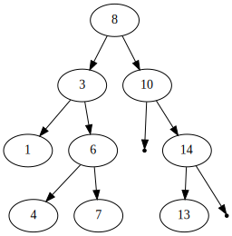

# Algorithms and Data Structure Assignment 02

Second assignment for AlgoDat, Summer Semester 2020.

Task:  Implement a **binary search tree**.

## Building
```sh
mkdir build
cd build
cmake ..
make
```
Executables will be in `build/source`.

## Running Tests

`catch.hpp` is used for the unit tests.  They can be run from the
`build/source` directory as `./tests` and are also automatically run
on [GitHub](https://github.com/jakobbbb/algodat-assignment-02).

## Example Output



## Interactive Use

A program for interactively manipulating the BST has been provided.
From the `build/source` directory, it is run as `./run`.  This is an
example session:

```
[jakob@neon source]$ ./run 
Available Commands:
	h	show help
	a	add to tree
	s	search in tree
	r	remove from tree
	p	print tree to file (- for stdout)
	size	print size
	q	quit
command? a
enter a number to add: 12
command? a
enter a number to add: 19
command? a
enter a number to add: -42
command? a
enter a number to add: 42
command? a
enter a number to add: 41
command? a
enter a number to add: 9
command? r
enter a number to remove: -42
command? s   
enter a number to search: -42
not found
command? s
enter a number to search: 42
found
command? size
tree contains 5 elements
command? p
enter a filename (- for stdout): -
digraph bst {
  "12" -> "9";
  "12" -> "19";
  "nil_19" [shape=point];
  "19" -> "nil_19";
  "19" -> "42";
  "42" -> "41";
  "nil_42" [shape=point];
  "42" -> "nil_42";
}
command? q
Goodbye :)
```

## References

**CLRS**:  Thomas H. Cormen, Charles E. Leiserson, Ronald L. Rivest, and
Clifford Stein. 2009. _Introduction to Algorithms_, Third Edition (3rd.
ed.). The MIT Press.
